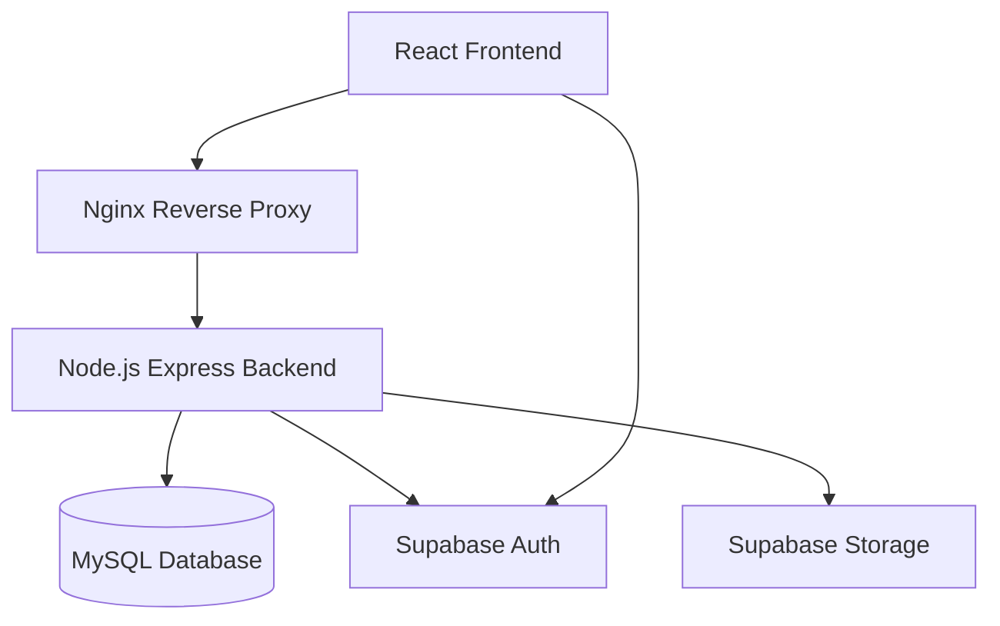

# Architecture: SIM-Beasiswa

**Domain:** Scholarship Management System
**Pattern:** Containerized Layered Monolith / Hybrid BaaS

## System Overview

The system follows a hybrid architecture where the core logic and data are managed by a custom **Node.js (Express)** backend and **MySQL**, while non-core services like Authentication and File Storage are delegated to **Supabase**.

### Component Architecture

| Layer | Responsibility |
|-------|----------------|
| **Presentation (React)** | User Interface, client-side validation, and state management. |
| **Gateway (Nginx)** | Load balancing, static file serving, and routing requests to the API. |
| **API Layer (Express)** | RESTful endpoints, request parsing, and routing. |
| **Business Logic** | Core rules for scoring, verification workflows, and status transitions. |
| **Data Access** | SQL queries and transactions via ORM (Sequelize/Knex). |
| **BaaS Integration** | Handling identity verification and secure document retrieval. |

## Data Flow Patterns

### 1. Unified Authentication
- Student logs in via **Supabase Auth** on the frontend.
- Frontend sends the `access_token` to the **Node.js API**.
- Node.js API verifies the token and maps it to a user in **MySQL** to fetch specific permissions or history.

### 2. Document Submission
- Student fills form in React.
- File (PDF) is uploaded directly to **Supabase Storage** (client-side) to reduce server load.
- Frontend sends the `file_path` and form data to **Node.js API**.
- Node.js API saves the metadata in **MySQL**.

### 3. Selection & Ranking
- Admin inputs scores into **Node.js API**.
- API calculates the final composite score in real-time or via a database view in **MySQL**.
- **Kabag** reviews the ranked results fetched from MySQL.

## Key Design Decisions

- **Database Separation:** MySQL handles relational business data (integrity), while Supabase handles Auth (security) and Storage (scalability).
- **Containerization:** All services (Frontend, Backend, MySQL) are wrapped in Docker for seamless deployment on "existing server" infrastructures.
- **Role Isolation:** Access control is enforced in the Node.js API by checking roles from Supabase JWTs before executing MySQL queries.

## Scalability & Performance

- **PDF Handling:** 5-second render target achieved by storing files in Supabase's globally distributed storage.
- **Database:** MySQL indexing on `NIM`, `scholarship_id`, and `status` for fast dashboard rendering.
- **Concurrency:** Node.js event-driven nature handles multiple simultaneous student pendaftar efficiently.
